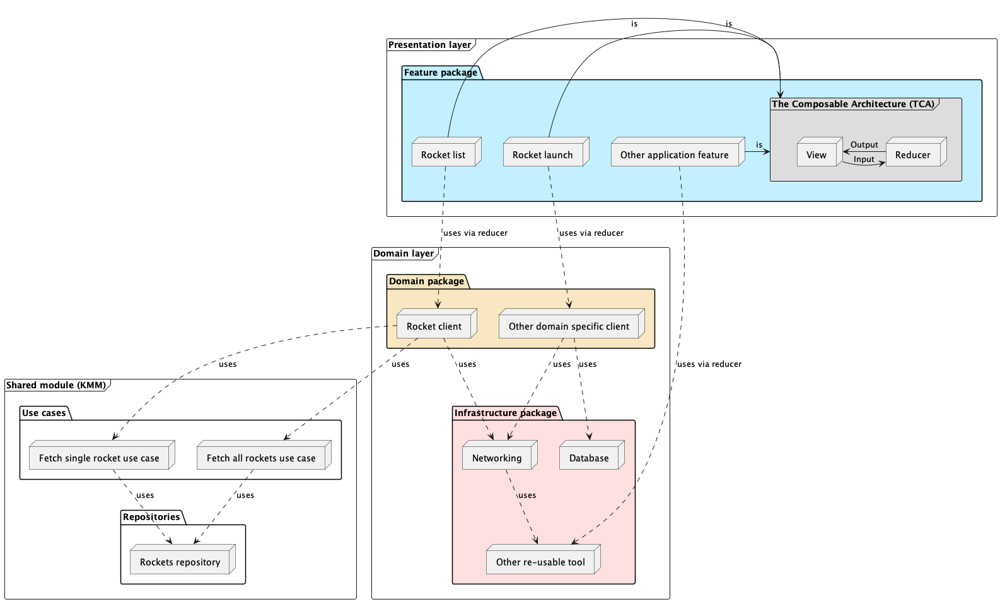
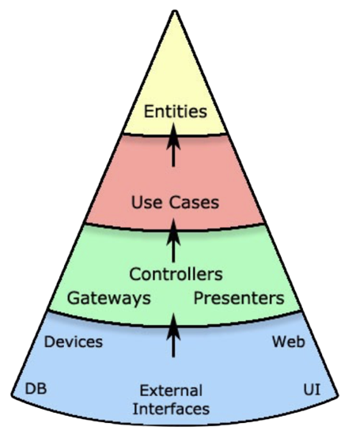

# iOS Solution

## Table of contents

- [Architecture](#architecture)
- [Clean Architecture principles](#clean-architecture-principles)
- [Kotlin Multiplatform Mobile](#kotlin-multiplatform-mobile)

## Architecture

The project is separated to two main logical parts. Those parts are `Domain` (do not mix up with the `Domain` package described below) and `Presentation`. 
- `Domain` part consists of `Infrastructure` and `Domain` packages
- `Presentation` part consists of `Feature` package

The `Presentation` part contains the actual application features and thus depends on the architecture of choice, [The Composable Architecture](https://github.com/pointfreeco/swift-composable-architecture). The `Domain` part does not depend on the architecture of choice and thus is resistent from the possible changes related to the future architecture design decisions.

`Presentation` and `Domain` logical parts do not have a direct representation within the project structure since they exist only to better understand the project decomposition from the highest level of abstraction. Instead they are directly represented in the project via packages they compose of. The project is organized into 3 main packages. Each package is basically a set of targets. Each target pairs with appropriate test target.

- `Infrastructure` package consists of all general tools. General tools can be reused across different projects. Those tools usually do not contain any UI. The package sits on the lowest level of the package layering system and thus it does not depend on other packages within the project.
- `Domain` package consists of all domain specific tools. Domain specific tools are coupled with an actual project and thus cannot be reused across different projects. Those tools usually do not contain any UI. The package sits on top of the `Infrastructure` package and thus it can depend on it. 
- `Feature` package consists of features. Such features form the actual application. They are best described as decomposed parts of the application. Features usually contain UI. The package sits on the highest level of the package layering system and thus it can depend on all other packages (`Infrastructure` and `Domain`). 

<!--
@startuml iosArchitecture

frame "Shared module (KMM)" {
   package "Use cases" {
      node "Fetch single rocket use case"
      node "Fetch all rockets use case"
   }

   package "Repositories" {
      node "Rockets repository"
   }

   "Fetch single rocket use case" ..> "Rockets repository" : uses
   "Fetch all rockets use case" ..> "Rockets repository" : uses
}

frame "Domain layer" {
   package "Infrastructure package" #Implementation {
      node Networking
      node Database
      node "Other re-usable tool"

      Networking ..> "Other re-usable tool" : uses
   }

   package "Domain package" #Strategy {
      node "Rocket client"
      node "Other domain specific client"
   }

   "Rocket client" ..> Networking: uses
   "Other domain specific client" ..> Networking : uses
   "Other domain specific client" ..> Database : uses

   "Rocket client" ..> "Fetch single rocket use case" : uses
   "Rocket client" ..> "Fetch all rockets use case" : uses
}

frame "Presentation layer" {
   package "Feature package" #Application {
      node "Rocket list" 
      node "Rocket launch"
      node "Other application feature"

      frame "The Composable Architecture (TCA)" #DDDDDD {
         node Reducer
         node View 

         Reducer -> View : Output
         View -> Reducer : Input
      }

      "Rocket list" -> "The Composable Architecture (TCA)" : is
      "Rocket launch" -> "The Composable Architecture (TCA)" : is
      "Other application feature" -> "The Composable Architecture (TCA)" : is
   }
}

"Rocket list" ..> "Rocket client" : uses via reducer
"Rocket launch" ..> "Other domain specific client" : uses via reducer
"Other application feature" ..> "Other re-usable tool" : uses via reducer

@enduml

-->

## Clean Architecture principles

Clean Architecture (best described in [this Youtube video](https://www.youtube.com/watch?v=2dKZ-dWaCiU&t=174s)) is sometimes wrongly compared to presentation layer architectures such as MVC, MVVM or TCA. Thus it is important to point out that Clean Architecture and presentation layer architectures lay on different
levels of abstraction. Clean Architecture is highly abstract set of rules that may be applied to any kind of software program. Presentation layer architectures, on the other hand, describe very specific components and the way they communicate with each other.

Clean Architecture basically describes how to decompose the application to various layers to enhance high cohesion and low coupling. Inspired by Clean Architecture, the application is split into multiple packages and targets. It does not use the domain language of Clean Architecture (which by our opinion does not play a significant role) but fully respects its highly refined layering. The proposed layering balances the overhead introduced by the additional layers while preserving its main qualities (testing in isolation, low impact factor on code changes).  

 Here is an image of individual layers of Clean Architecture:

Here is how those layers relate to the application: 
- `Entities` == models within the `Domain` package
- `Use Cases` == functions of clients within the `Domain` package
- `Gateways / Controllers / Presenters` == tools interfaces within the `Infrastructure` package, `reducers` (TCA) within the `Feature` package 
- `Devices / DB / External Interfaces / Web / UI` == tools implementations within the `Infrastructure` package, `Views` within the `Feature` package

## Kotlin Multiplatform Mobile

The architecture presented enables to integrate platform shared KMM functionality. Such functionality is usually provided via `use cases`, since Kotlin development is built on the Clean Architecture principles. The `uses cases` can be integrated to individual `clients` in the `Domain` package of the iOS architecture. More on the KMM integration can be found [here](Docs/KMM/README.md).
